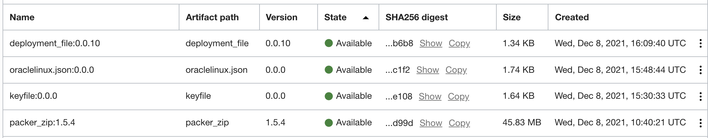

Sample Illustration to execute packer from a OCI Host with private subnet..
-------

✔️ Generic flow 

- Build an instance with Oracle linux and with a private subnet.
- Using OCI Artifact and OCI CLI invoke the deployment commands on host.
- Build a custom image and upload back to OCI custom list.


✔️ Procedure to use 

- Create an artifact repo and upload necessary artifacts as mentioned 

```
    1) deployment.yaml.
    2) oraclelinux.json.
    3) packer.zip to use
    3) encrypted user key file.
```



- Create a deployment pipeline with the uploaded artifact (deployment.yaml) as artifact and the private host as an env to deploy.
- Ensure to set all the below variables as paramter for the deployment (or parse it from build stage )

```
CLIENT_JSON_VERSIONED_ID <OCID of artifact oraclelinux.json>

PEMFILE_OCID <OCID of artifact pemfile>

subnet_ocid <OCID of vcn subnet to use>

compartment_ocid <OCID of compartment>

base_image_ocid <OCID of base oracle linux image>

region <OCI Region>

availability_domain <OCI AD>

fingerprint <OCI Fingreprint>

tenancy_ocid <OCID of tenancy>

user_ocid <OCID od user >

ARTIFACT_VERSIONED_ID <OCID of Artifact repo>

PACKER_REPO_ID <OCID of artifact packer image>

```


✔️ References

- Artifacts repo - https://docs.oracle.com/en-us/iaas/Content/artifacts/manage-artifacts.htm 

- Deployment pipeline - https://docs.oracle.com/en-us/iaas/Content/devops/using/deployment_pipelines.htm 

- Refer OCI documentations for policies and others access related.